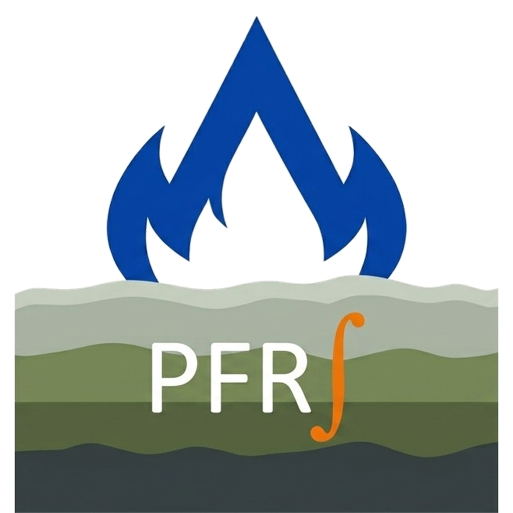
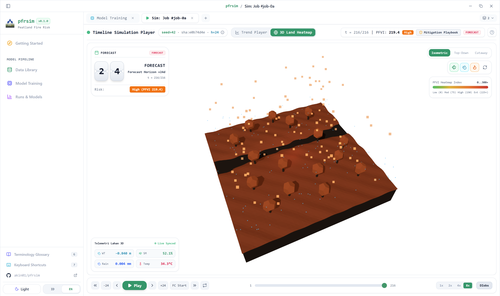
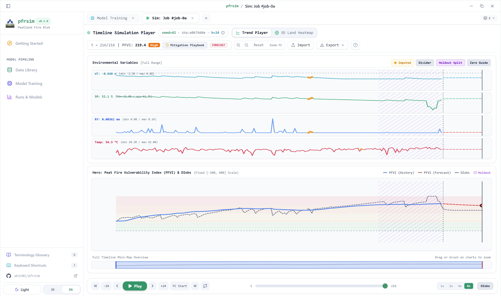
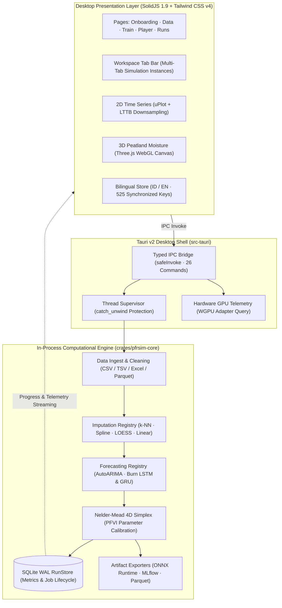

<div align="center">



# pfrsim

**Tropical Peatland Fire Risk Simulator (Desktop App)**

A high-performance, reproducible desktop application with timeframe animation, 3D peatland moisture rendering, and deep learning forecasting, inspired by the [`peatfr`](https://github.com/mellygsln/peatfr) package (`autopeatfr`: impute → forecast → PFVI) by [Mahdiyasa et al. (2025)](https://doi.org/10.1016/j.ecoinf.2025.103532).

[](crates/pfrsim-core)
[](apps/desktop)
[](apps/desktop/package.json)
[](LICENSE)

<br /><br />



*Interactive Three.js 3D Peatland Moisture, Water Table Depth, and Fire Risk Terrain Simulator*

<br /><br />



*High-Density 2D uPlot Environmental Time Series and Calibrated Peat Fire Vulnerability Index (PFVI) Forecasting*

</div>

---

Direction: **Pure Rust in-process core — no Python or R sidecars.** All numerics run inside the Tauri v2 binary (`src-tauri` + `crates/pfrsim-core`); the frontend is built with SolidJS 1.9 + Vite 8 + Tailwind CSS v4 in the OS webview. Single binary (~17 MB), no external runtime to install, no localhost HTTP, no process supervision.

---

## Quick Start

```bash
# Full desktop application with hot-reloading (Tauri v2 + SolidJS 1.9)
pnpm dev

# Frontend-only development in standard web browser (http://localhost:1420)
# Includes full browser mock IPC fallback for all 26 Tauri commands
pnpm dev:frontend

# Run Rust core test suite (parity, determinism, RunStore, algorithms)
pnpm test:core
# (or: cargo test --workspace)

# Run frontend test suite (Vitest + JSDOM)
pnpm test:frontend
```

---

## Key Capabilities & Engineering Highlights

1. **Deterministic Replay**: Identical inputs + config + seed produce byte-identical `frames_sha256`. Playback reads solely from stored `frames.parquet`/`frames.json` with the Rust numerics engine idle.
2. **Deep Learning Recurrent Forecasting with Burn**:
   - Native Rust neural networks (`lstm.rs` and `gru.rs`) executed via the **Burn** framework.
   - Dual-backend acceleration: multi-threaded CPU (`NdArray<f32>`) and GPU compute shaders (`Autodiff<Wgpu>`).
   - Configurable hyperparameters: Adam learning rate ($\eta \in [0.001, 0.1]$), mini-batch sizing ($B \in [16, 2048]$ or Full Batch $0$), sequence lookback ($L$), and hidden state dimensionality ($d$).
3. **Multi-Tab Workspace Navigation**:
   - Dedicated `WorkspaceTabBar` supporting multiple concurrent simulation instances (`PlayerPage`), draggable tab reordering, overflow dropdown, and tab lifecycle shortcuts.
4. **Single-Source-of-Truth Bilingual i18n**:
   - 100% key parity between Indonesian (`id`) and English (`en`) with **525 synchronized translation keys**.
   - Zero-reload reactive switching backed by SolidJS store reactivity.
5. **Zero Runtime Installs**: Single standalone executable. No `pip`, no R packages, no Python or TensorFlow dependencies at runtime.
6. **Resilient Job Supervision**: Training tasks run on an independent thread protected by `std::panic::catch_unwind`, ensuring no numerical edge-case can crash the desktop window.

---

## System Architecture



---

## Building from Source

### 1. Prerequisites

Ensure the following toolchains are installed on your host machine:

- **Rust Toolchain**: `1.85` or later (`rustup default stable`)
- **Node.js**: `20.x` or `22.x` LTS
- **pnpm**: `10.x` or later (`corepack enable pnpm` or `npm install -g pnpm`)

### 2. System Dependencies

Depending on your operating system, install the required native build libraries:

- **Windows**:
  - Microsoft Visual Studio C++ Build Tools (with "Desktop development with C++").
  - Windows 10/11 includes WebView2 runtime by default.
- **Linux (Ubuntu / Debian)**:
  ```bash
  sudo apt update
  sudo apt install -y \
    libwebkit2gtk-4.1-dev \
    build-essential \
    curl \
    wget \
    file \
    libxdo-dev \
    libssl-dev \
    libayatana-appindicator3-dev \
    librsvg2-dev
  ```
- **macOS**:
  - Xcode Command Line Tools:
    ```bash
    xcode-select --install
    ```

### 3. Step-by-Step Compilation

1. **Clone the Repository**:
   ```bash
   git clone https://github.com/akin01/pfrsim.git
   cd pfrsim
   ```

2. **Install Node Dependencies**:
   ```bash
   pnpm install
   ```

3. **Verify Tests**:
   ```bash
   # Run Rust core tests (parity, determinism, RunStore, and numerical algorithms)
   pnpm test:core

   # Run frontend unit and component tests
   pnpm test:frontend
   ```

4. **Compile Production Release**:
   ```bash
   # Build optimized web assets (outputs to apps/desktop/dist/)
   pnpm build:frontend

   # Compile standalone native executable
   cargo build --release -p pfrsim-desktop
   ```

   The final binary is placed at:
   - **Windows**: `target/release/pfrsim-desktop.exe`
   - **macOS / Linux**: `target/release/pfrsim-desktop`

5. **(Optional) Package Native Platform Bundles**:
   To generate signed installers (`.msi` / `.exe` on Windows, `.deb` / `.AppImage` on Linux, `.dmg` on macOS):
   ```bash
   pnpm tauri build
   ```
   Installers are generated in `src-tauri/target/release/bundle/`.

---

## License

This project and all workspace packages are open source and licensed under the [MIT License](LICENSE).

| Package / Application | Directory | Description | License |
| :--- | :--- | :--- | :--- |
| **`pfrsim`** | Root (`/`) | Monorepo root workspace & documentation | [MIT](LICENSE) |
| **`pfrsim-core`** | [`crates/pfrsim-core`](crates/pfrsim-core) | Core numerical, forecasting & PFVI engine | [MIT](crates/pfrsim-core/LICENSE) |
| **`pfrsim-desktop` (UI)** | [`apps/desktop`](apps/desktop) | SolidJS 1.9 + Tailwind CSS v4 desktop frontend | [MIT](apps/desktop/LICENSE) |
| **`pfrsim-desktop` (Shell)** | [`src-tauri`](src-tauri) | Tauri v2 native desktop application shell | [MIT](src-tauri/LICENSE) |

See [LICENSE](LICENSE) for full details.
