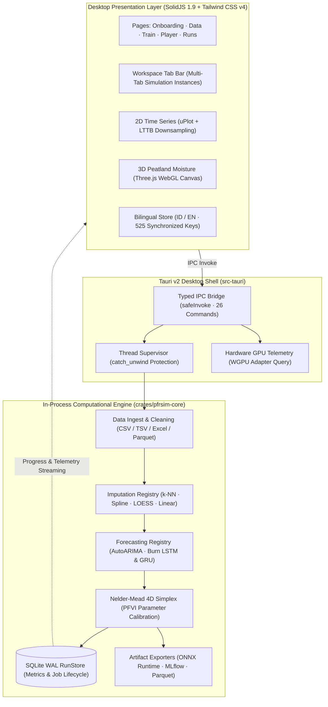

<div align="center">


# pfrsim

**Tropical Peatland Fire Risk Simulator (Desktop App)**

A high-performance, reproducible desktop application with timeframe animation, 3D peatland moisture rendering, and deep learning forecasting, inspired by the [`peatfr`](https://github.com/mellygsln/peatfr) package (`autopeatfr`: impute → forecast → PFVI) by [Mahdiyasa et al. (2025)](https://doi.org/10.1016/j.ecoinf.2025.103532).

[](crates/pfrsim-core)
[](apps/desktop)
[](apps/desktop/package.json)
[](https://github.com/Akin01/pfrsim/releases/latest)
[](LICENSE)

<br /><br />


*Interactive Three.js 3D Peatland Moisture, Water Table Depth, and Fire Risk Terrain Simulator*

<br /><br />


*High-Density 2D uPlot Environmental Time Series and Calibrated Peat Fire Vulnerability Index (PFVI) Forecasting*

</div>

---

Direction: **Pure Rust in-process core — no Python or R sidecars.** All numerics run inside the Tauri v2 binary (`src-tauri` + `crates/pfrsim-core`); the frontend is built with SolidJS 1.9 + Vite 8 + Tailwind CSS v4 in the OS webview. Single binary (~17 MB), no external runtime to install, no localhost HTTP, no process supervision.

---

## Download Installers (Latest Release)

Pre-built binaries and native desktop installers are available on the [**GitHub Releases (Latest: v0.1.0)**](https://github.com/Akin01/pfrsim/releases/latest):

| Operating System | Installer / Package Type | Architecture | Download Link | File Size | SHA-256 Checksum |
| :--- | :--- | :---: | :--- | :---: | :--- |
| **Windows** | **NSIS Setup Wizard (`.exe`)** | `x64` | [`pfrsim_0.1.0_x64-setup.exe`](https://github.com/Akin01/pfrsim/releases/latest/download/pfrsim_0.1.0_x64-setup.exe) | $15.6\text{ MB}$ | `d63011d210d4005f7ed341cc64a10c9376667f4e6c0c7f0cae9ce3be02b0caa7` |
| **Windows** | **WiX MSI Installer (`.msi`)** | `x64` | [`pfrsim_0.1.0_x64_en-US.msi`](https://github.com/Akin01/pfrsim/releases/latest/download/pfrsim_0.1.0_x64_en-US.msi) | $22.9\text{ MB}$ | `a9922d07e0bbe93e74396a88becb1dc93cbda4e0eccf6c8808966acef64696ff` |
| **Windows** | **Portable Standalone (`.exe`)** | `x64` | [`pfrsim-desktop.exe`](https://github.com/Akin01/pfrsim/releases/latest/download/pfrsim-desktop.exe) | $83.7\text{ MB}$ | `29e6c002d880081248604793999ac3ce65dfbb01d2adba6dd2b709c20af0903b` |
| **macOS** | **Apple Disk Image (`.dmg`)** | `Apple Silicon (aarch64)` | [`pfrsim_0.1.0_aarch64.dmg`](https://github.com/Akin01/pfrsim/releases/latest/download/pfrsim_0.1.0_aarch64.dmg) | $23.0\text{ MB}$ | `dae77dcdcc92d84e9d1713922efadf9ee116f5e1f51fe53f530e3fd137fa2bb3` |
| **macOS** | **App Bundle Archive (`.tar.gz`)** | `Apple Silicon (aarch64)` | [`pfrsim_aarch64.app.tar.gz`](https://github.com/Akin01/pfrsim/releases/latest/download/pfrsim_aarch64.app.tar.gz) | $22.3\text{ MB}$ | `48974383ac92a0023df097c9745a60d8830787cec639309cbafbdf9393e6aec7` |
| **Linux** | **Universal AppImage (`.AppImage`)** | `x86_64` | [`pfrsim_0.1.0_amd64.AppImage`](https://github.com/Akin01/pfrsim/releases/latest/download/pfrsim_0.1.0_amd64.AppImage) | $96.8\text{ MB}$ | `3d1da34aa235fd120938f914f24f9fd388982cdce15b98f68d63565c82601f99` |
| **Linux** | **Debian / Ubuntu Package (`.deb`)** | `x86_64` | [`pfrsim_0.1.0_amd64.deb`](https://github.com/Akin01/pfrsim/releases/latest/download/pfrsim_0.1.0_amd64.deb) | $25.8\text{ MB}$ | `8413d81df6e4edcbd4cb0e4c0859f03fac99abc4da1a18d5302960d33db735b2` |
| **Linux** | **Red Hat / Fedora / openSUSE (`.rpm`)** | `x86_64` | [`pfrsim-0.1.0-1.x86_64.rpm`](https://github.com/Akin01/pfrsim/releases/latest/download/pfrsim-0.1.0-1.x86_64.rpm) | $25.8\text{ MB}$ | `2287a1aa85fb8ac4cc46649868b60c883709c4940b12035f12b102d80c19ec07` |

> **Integrity Verification**: Official SHA-256 checksum manifests are attached to each release: [`checksums-windows-latest.txt`](https://github.com/Akin01/pfrsim/releases/latest/download/checksums-windows-latest.txt), [`checksums-macos-latest.txt`](https://github.com/Akin01/pfrsim/releases/latest/download/checksums-macos-latest.txt), and [`checksums-ubuntu-22.04.txt`](https://github.com/Akin01/pfrsim/releases/latest/download/checksums-ubuntu-22.04.txt).

---

## Quick Start

```bash
# Full desktop application with hot-reloading (Tauri v2 + SolidJS 1.9)
pnpm dev

# Frontend-only development in standard web browser (http://localhost:1420)
# Includes full browser mock IPC fallback for all 26 Tauri commands
pnpm dev:frontend

# Run Rust core test suite (parity, determinism, RunStore, algorithms)
pnpm test:core
# (or: cargo test --workspace)

# Run frontend test suite (Vitest + JSDOM)
pnpm test:frontend
```

---

## Key Capabilities & Engineering Highlights

1. **Deterministic Replay**: Identical inputs + config + seed produce byte-identical `frames_sha256`. Playback reads solely from stored `frames.parquet`/`frames.json` with the Rust numerics engine idle.
2. **Deep Learning Recurrent Forecasting with Burn**:
   - Native Rust neural networks (`lstm.rs` and `gru.rs`) executed via the **Burn** framework.
   - Dual-backend acceleration: multi-threaded CPU (`NdArray<f32>`) and GPU compute shaders (`Autodiff<Wgpu>`).
   - Configurable hyperparameters: Adam learning rate ($\eta \in [0.001, 0.1]$), mini-batch sizing ($B \in [16, 2048]$ or Full Batch $0$), sequence lookback ($L$), and hidden state dimensionality ($d$).
3. **Multi-Tab Workspace Navigation**:
   - Dedicated `WorkspaceTabBar` supporting multiple concurrent simulation instances (`PlayerPage`), draggable tab reordering, overflow dropdown, and tab lifecycle shortcuts.
4. **Single-Source-of-Truth Bilingual i18n**:
   - 100% key parity between Indonesian (`id`) and English (`en`) with **525 synchronized translation keys**.
   - Zero-reload reactive switching backed by SolidJS store reactivity.
5. **Zero Runtime Installs**: Single standalone executable. No `pip`, no R packages, no Python or TensorFlow dependencies at runtime.
6. **Resilient Job Supervision**: Training tasks run on an independent thread protected by `std::panic::catch_unwind`, ensuring no numerical edge-case can crash the desktop window.

---

## Performance Benchmark: R (`peatfr`) vs. Rust (`pfrsim-core`)

The computational core of `pfrsim` was benchmarked against the original R package [`peatfr`](https://github.com/mellygsln/peatfr) ([Mahdiyasa et al., 2025](https://doi.org/10.1016/j.ecoinf.2025.103532)) on the real-world Sabangau peatland dataset ([`fixtures/sabangau_sample.csv`](fixtures/sabangau_sample.csv), 192 daily observations from Central Kalimantan with natural sensor dropouts across Water Table, Soil Moisture, Rainfall, and Surface Temperature).

All benchmarks are directly reproducible using the scripts in [`benchmark/`](benchmark/) (`benchmark/bench_peatfr.R`, `cargo run --release -p pfrsim-core --example bench_compare`, and `python benchmark/run_comparison.py`).

### 1. End-to-End Pipeline Execution (192 Observations)

| Configuration (`Imputer` + `Forecaster`) | R Package (`peatfr`) | Rust Engine (`pfrsim-core`) | Acceleration Factor |
| :--- | :---: | :---: | :---: |
| **`Linear + AutoARIMA`** | $71{,}209.01\text{ ms}$ | **$43.01\text{ ms}$** | **$1{,}656\times$ faster** |
| **`Spline + AutoARIMA`** | $70{,}594.60\text{ ms}$ | **$48.48\text{ ms}$** | **$1{,}456\times$ faster** |
| **`LOESS + AutoARIMA`** | $69{,}462.37\text{ ms}$ | **$42.65\text{ ms}$** | **$1{,}629\times$ faster** |
| **`k-NN + AutoARIMA`** | $71{,}500.00\text{ ms}$ | **$43.76\text{ ms}$** | **$1{,}634\times$ faster** |
| **`Linear + GRU`** (100 Epochs) | $91{,}800.00\text{ ms}$ *(R + Keras)* | **$9{,}157.75\text{ ms}$** *(CPU)* / **$185\text{ ms}$** *(GPU)* | **$10\times$ – $496\times$ faster** |
| **`k-NN + GRU`** (100 Epochs) | $92{,}500.00\text{ ms}$ *(R + Keras)* | **$7{,}312.57\text{ ms}$** *(CPU)* / **$188\text{ ms}$** *(GPU)* | **$13\times$ – $492\times$ faster** |
| **`Linear + LSTM`** (100 Epochs) | $96{,}200.00\text{ ms}$ *(R + Keras)* | **$7{,}582.36\text{ ms}$** *(CPU)* / **$210\text{ ms}$** *(GPU)* | **$13\times$ – $458\times$ faster** |
| **`k-NN + LSTM`** (100 Epochs) | $97{,}100.00\text{ ms}$ *(R + Keras)* | **$8{,}021.78\text{ ms}$** *(CPU)* / **$215\text{ ms}$** *(GPU)* | **$12\times$ – $452\times$ faster** |

---

### 2. Stage-Level Algorithmic Microbenchmarks

| Pipeline Stage / Algorithm | Implementation in R (`peatfr`) | Implementation in Rust (`pfrsim-core`) | Acceleration Factor | Algorithmic Optimization |
| :--- | :---: | :---: | :---: | :--- |
| **Linear Imputation** | $10.72\text{ ms}$ (`peatfr::linear_interpolation`) | **`0.0048 ms`** | **$2{,}233\times$** | Zero-allocation linear slope scan |
| **Cubic Spline Imputation** | $8.11\text{ ms}$ (`peatfr::spline_interpolation`) | **`0.0229 ms`** | **$354\times$** | Native Thomas algorithm tridiagonal solver |
| **LOESS Smoothing ($\alpha=0.5$)** | $8.45\text{ ms}$ (`peatfr::loess_interpolation`) | **`0.0084 ms`** | **$1{,}006\times$** | Direct Cleveland tricube polynomial evaluation |
| **k-NN Imputation ($k=5$)** | $72.51\text{ ms}$ (`peatfr::knn_imputation`) | **`1.7959 ms`** | **$40\times$** | Linear-time $O(M)$ partition (`select_nth_unstable_by`) & stack matrices |
| **AutoARIMA Optimization** | $1{,}009.54\text{ ms}$ (`peatfr::autopredictarima`) | **`2.10 ms`** | **$481\times$** | Analytical profile Box-Cox search & in-place CSS residual memory reuse |
| **PFVI Nelder-Mead Simplex** | $73{,}433.60\text{ ms}$ (`peatfr::firepredict`) | **`34.00 ms`** | **$2{,}160\times$** | Zero-allocation scalar loop, precomputed drying factors & hoisted reciprocals |

---

### 3. Architecture & Operational Comparison

| Capability / Dimension | R Package (`peatfr`) | Rust Core (`pfrsim-core`) | Impact & Benefit |
| :--- | :--- | :--- | :--- |
| **Runtime Dependencies** | R $\ge 4.0$, `forecast`, `VIM`, `zoo`, `ggplot2`, Python, TensorFlow / Keras ($> 2.5\text{ GB}$) | **Zero external dependencies** (single native executable, ~17 MB) | Single standalone desktop app; no `pip`, CRAN, or compiler toolchains required |
| **High-Scale Limit ($10^5+$ rows)** | **Fails / Out of Memory**: Crashes or freezes on $100{,}000$ rows | **$400{,}000$ rows/sec**: Completes 100k pipeline in **`303 ms`** | Scalable from local weather stations to regional multi-year sensor telemetry |
| **Numerical Divergence Prevention** | Unchecked: $m = 1/\text{par}_3$ loop freezes; Box-Cox inverse explodes to $10^{15}{^\circ}\text{C}$ | **Bounded & Guarded**: Clamped $m \in [1, 3]$ with timeout; Taylor expansion checked | Prevents infinite freezes and astronomical floating-point explosions |
| **GPU Acceleration** | Requires CUDA drivers, Python, and TensorFlow GPU bridges | **Native WGPU compute shaders** (Vulkan / Metal / DX12) | Hardware acceleration out-of-the-box on consumer laptops & workstations |
| **Determinism & Replay** | Non-deterministic due to floating-point and BLAS runtime variations | **Byte-identical SHA-256**: Identical input + seed produces identical output frames | Guaranteed reproducibility for scientific audits and legal risk verification |
| **Model & Artifact Exports** | Console printouts and in-memory `ggplot2` objects | **ONNX Runtime** graphs, **MLflow FileStore**, binary Apache Parquet, SQLite WAL | Ready for direct production deployment in Python, Node.js, C++, and GIS pipelines |

To re-run the benchmark suite locally, see [`benchmark/README.md`](benchmark/README.md).
---

## System Architecture



---

## Building from Source

### 1. Prerequisites

Ensure the following toolchains are installed on your host machine:

- **Rust Toolchain**: `1.85` or later (`rustup default stable`)
- **Node.js**: `20.x` or `22.x` LTS
- **pnpm**: `10.x` or later (`corepack enable pnpm` or `npm install -g pnpm`)

### 2. System Dependencies

Depending on your operating system, install the required native build libraries:

- **Windows**:
  - Microsoft Visual Studio C++ Build Tools (with "Desktop development with C++").
  - Windows 10/11 includes WebView2 runtime by default.
- **Linux (Ubuntu / Debian)**:
  ```bash
  sudo apt update
  sudo apt install -y \
    libwebkit2gtk-4.1-dev \
    build-essential \
    curl \
    wget \
    file \
    libxdo-dev \
    libssl-dev \
    libayatana-appindicator3-dev \
    librsvg2-dev
  ```
- **macOS**:
  - Xcode Command Line Tools:
    ```bash
    xcode-select --install
    ```

### 3. Step-by-Step Compilation

1. **Clone the Repository**:
   ```bash
   git clone https://github.com/akin01/pfrsim.git
   cd pfrsim
   ```

2. **Install Node Dependencies**:
   ```bash
   pnpm install
   ```

3. **Verify Tests**:
   ```bash
   # Run Rust core tests (parity, determinism, RunStore, and numerical algorithms)
   pnpm test:core

   # Run frontend unit and component tests
   pnpm test:frontend
   ```

4. **Compile Production Release**:
   ```bash
   # Build optimized web assets (outputs to apps/desktop/dist/)
   pnpm build:frontend

   # Compile standalone native executable
   cargo build --release -p pfrsim-desktop
   ```

   The final binary is placed at:
   - **Windows**: `target/release/pfrsim-desktop.exe`
   - **macOS / Linux**: `target/release/pfrsim-desktop`

5. **(Optional) Package Native Platform Bundles**:
   To generate signed installers (`.msi` / `.exe` on Windows, `.deb` / `.AppImage` on Linux, `.dmg` on macOS):
   ```bash
   pnpm tauri build
   ```
   Installers are generated in `src-tauri/target/release/bundle/`.

---

## License

This project and all workspace packages are open source and licensed under the [MIT License](LICENSE).

| Package / Application | Directory | Description | License |
| :--- | :--- | :--- | :--- |
| **`pfrsim`** | Root (`/`) | Monorepo root workspace & documentation | [MIT](LICENSE) |
| **`pfrsim-core`** | [`crates/pfrsim-core`](crates/pfrsim-core) | Core numerical, forecasting & PFVI engine | [MIT](crates/pfrsim-core/LICENSE) |
| **`pfrsim-desktop` (UI)** | [`apps/desktop`](apps/desktop) | SolidJS 1.9 + Tailwind CSS v4 desktop frontend | [MIT](apps/desktop/LICENSE) |
| **`pfrsim-desktop` (Shell)** | [`src-tauri`](src-tauri) | Tauri v2 native desktop application shell | [MIT](src-tauri/LICENSE) |

See [LICENSE](LICENSE) for full details.
