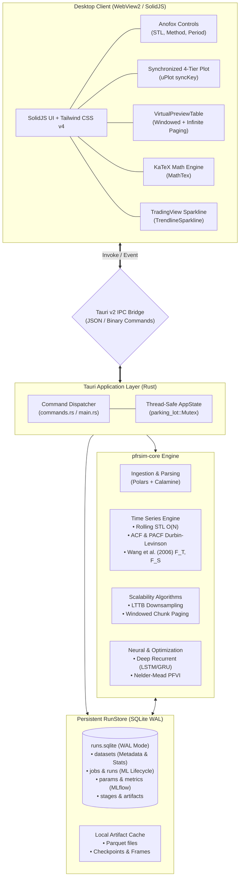
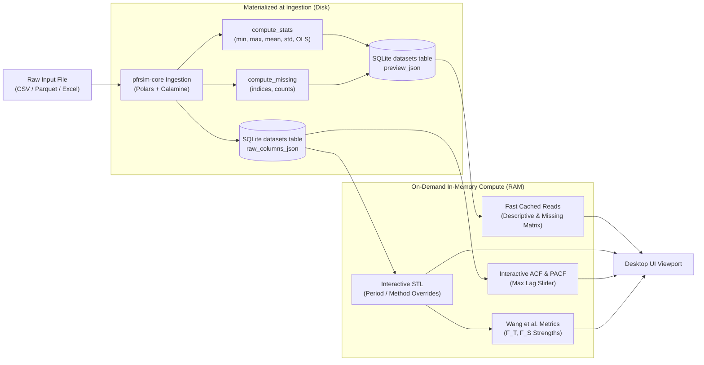
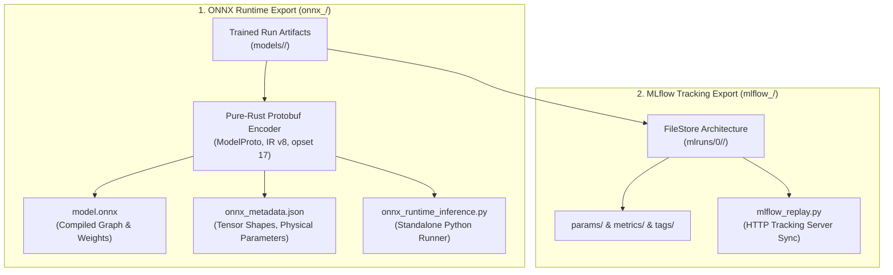
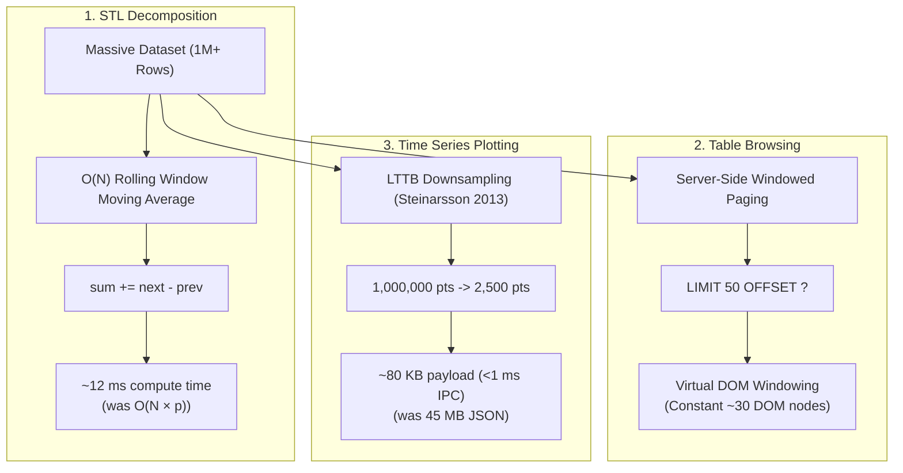

# pfrsim — System Architecture & Data Pipeline Reference

This document provides a comprehensive technical reference for the architecture of **`pfrsim`** (Peatland Fire Risk Simulator), covering the Tauri v2 desktop shell, the in-process Rust numerical engine (`pfrsim-core`), the SQLite WAL storage layer, and the analytical data exploration system.

---

## 1. High-Level System Architecture

`pfrsim` is engineered as a local-first, zero-Python desktop application. Heavy mathematical computations, neural network training, optimization, and time series decompositions execute natively in compiled Rust CPU code.



---

## 2. Data Storage & Materialization Strategy

The application employs a **hybrid materialization strategy** balancing cold-start latency against interactive throughput.


### 2.1 SQLite WAL Schema (`runs.sqlite`)
The storage engine runs on SQLite configured with Write-Ahead Logging (`WAL`), `NORMAL` synchronous commits, and a $5{,}000\text{ ms}$ busy timeout:

```sql
CREATE TABLE IF NOT EXISTS datasets (
    id TEXT PRIMARY KEY,
    name TEXT NOT NULL,
    csv_sha TEXT NOT NULL,
    n INTEGER NOT NULL,
    preview_json TEXT NOT NULL,       -- Materialized summary stats & missing info
    raw_columns_json TEXT NOT NULL,   -- Complete series arrays (WT, SM, Rf, Temp)
    created_at TEXT NOT NULL
);

CREATE TABLE IF NOT EXISTS jobs (
    id TEXT PRIMARY KEY,
    dataset_id TEXT NOT NULL,
    config_hash TEXT NOT NULL,
    seed INTEGER NOT NULL,
    status TEXT NOT NULL,             -- "queued" | "running" | "done" | "error"
    stage TEXT,
    progress REAL NOT NULL DEFAULT 0.0,
    run_id TEXT,
    error TEXT,
    created_at TEXT NOT NULL,
    finished_at TEXT
);

CREATE TABLE IF NOT EXISTS runs (
    id TEXT PRIMARY KEY,
    job_id TEXT NOT NULL,
    dataset_id TEXT NOT NULL,
    name TEXT NOT NULL,
    created_at TEXT NOT NULL,
    status TEXT NOT NULL,
    csv_sha TEXT NOT NULL,
    seed INTEGER NOT NULL,
    config_json TEXT NOT NULL
);

CREATE TABLE IF NOT EXISTS stages (
    id TEXT PRIMARY KEY,
    run_id TEXT NOT NULL,
    stage TEXT NOT NULL,
    status TEXT NOT NULL,
    started_at TEXT NOT NULL,
    finished_at TEXT
);

CREATE TABLE IF NOT EXISTS params (
    run_id TEXT NOT NULL,
    key TEXT NOT NULL,
    value TEXT NOT NULL,
    PRIMARY KEY (run_id, key)
);

CREATE TABLE IF NOT EXISTS metrics (
    run_id TEXT NOT NULL,
    stage TEXT NOT NULL,
    key TEXT NOT NULL,
    value REAL NOT NULL
);

CREATE TABLE IF NOT EXISTS artifacts (
    run_id TEXT NOT NULL,
    kind TEXT NOT NULL,
    path TEXT NOT NULL,
    sha256 TEXT NOT NULL,
    PRIMARY KEY (run_id, kind)
);

CREATE INDEX IF NOT EXISTS idx_datasets_csv_sha ON datasets(csv_sha);
CREATE INDEX IF NOT EXISTS idx_jobs_dataset ON jobs(dataset_id);
CREATE INDEX IF NOT EXISTS idx_runs_dataset ON runs(dataset_id);
CREATE INDEX IF NOT EXISTS idx_metrics_run ON metrics(run_id);
CREATE INDEX IF NOT EXISTS idx_params_run ON params(run_id);
CREATE INDEX IF NOT EXISTS idx_stages_run ON stages(run_id);
```

### 2.2 Materialized vs. On-Demand Computation Matrix

| Component | Lifecycle | Compute Location | Latency | Storage Target |
| :--- | :--- | :--- | :--- | :--- |
| **Descriptive Statistics** | Import time | `pfrsim-core::ingest::compute_stats` | Single-pass | `datasets.preview_json` |
| **Missing Value Matrix** | Import time | `pfrsim-core::ingest::compute_missing` | Single-pass | `datasets.preview_json` |
| **OLS Trend Diagnostics** | Import time | `pfrsim-core::ingest::compute_trend` | $\mathcal{O}(N)$ | `datasets.preview_json` |
| **Raw Column Series** | Import time | `polars` / `calamine` parser | Ingestion | `datasets.raw_columns_json` |
| **STL Decomposition** | On-Demand | `compute_decomposition_ext` | $\approx 1\text{ ms}$ | Rust memory (ephemeral) |
| **Wang et al. (2006) Metrics** | On-Demand | `sample_variance` ratios | $< 0.1\text{ ms}$ | Returned via IPC |
| **ACF & PACF Lags** | On-Demand | `compute_autocorrelation` | $< 1\text{ ms}$ | Returned via IPC |
| **LTTB Downsampling** | On-Demand | `lttb_downsample` | $\approx 2\text{ ms}$ | Viewport IPC cache |


### 2.3 Operational Model Export Hub (ONNX Runtime & MLflow)

To facilitate deployment across enterprise and research infrastructures, `pfrsim-core` provides dual export formats:



1. **ONNX Runtime Bundle (`onnx_<run_id>/`)**:
   - **Binary Graph**: `model.onnx` encodes input sequences $[1, L, 4]$, projection matrix $GEMM$, reshape to $[1, h, 4]$, and clamped PFVI response $[1, h]$.
   - **Cross-Platform Compatibility**: Fully executable across Python (`onnxruntime`), Node.js (`onnxruntime-node`), C++ (`onnxruntime_cxx_api.h`), and Rust (`ort`).
   - **Replay Script**: `onnx_runtime_inference.py` loads the model, generates sample sensor trajectories, executes inference, and displays formatted risk classifications.

2. **MLflow Tracking Bundle (`mlflow_<run_id>/`)**:
   - **Native FileStore**: Generates standard `mlruns/0/<run_id>/` layout with `meta.yaml`, `params/`, `metrics/`, and `tags/`.
   - **Replay Script**: `mlflow_replay.py` ingests local metrics into remote/cloud MLflow servers with a single command.
---

## 3. Mathematical & Algorithmic Foundations

### 3.1 Classical & Extended STL Decomposition
The time series $y_t$ is separated into additive components:

$$y_t = T_t + S_t + R_t$$

- **$T_t$ (Trend)**: Extracted via a centered moving average over window length $p$:
  $$T_t = \frac{1}{p} \sum_{j = -\lfloor p/2 \rfloor}^{\lfloor (p-1)/2 \rfloor} y_{t+j}$$
- **$S_t$ (Seasonal Profile)**: Calculated by detrending ($y_t - T_t$), averaging across positions $t \pmod p$, and centering the resulting profile:
  $$S_t = \bar{D}_{t \pmod p} - \frac{1}{p} \sum_{c=0}^{p-1} \bar{D}_c$$
- **$R_t$ (Residual)**: Leftover noise component:
  $$R_t = y_t - T_t - S_t$$
- **Trend-Only Mode**: When `is_trend_only` is toggled (e.g. for monotonic variables like groundwater depth), $S_t \equiv 0$ and $y_t = T_t + R_t$.

### 3.2 Wang, Smith, & Hyndman (2006) Feature Metrics
To evaluate the relative importance of trend and seasonality without arbitrary pre-filtering, the engine computes normalized strength indices:

$$F_T = \max\left(0, 1 - \frac{\text{Var}(R)}{\text{Var}(T + R)}\right), \quad F_S = \max\left(0, 1 - \frac{\text{Var}(R)}{\text{Var}(S + R)}\right)$$

- $F_T \to 1.0$: Strong deterministic trend (e.g. $0.997$).
- $F_S \to 1.0$: Strong periodic oscillation (e.g. $0.966$).
- $F_S \le 0.1$: Non-seasonal or white noise residual.

### 3.3 Autocorrelation (ACF) & Durbin-Levinson PACF
- **Sample Autocorrelation (ACF)**:
  $$r_k = \frac{\sum_{t=0}^{N-1-k} (y_t - \bar{y})(y_{t+k} - \bar{y})}{\sum_{t=0}^{N-1} (y_t - \bar{y})^2}, \quad k \in [0, \text{max\_lag}]$$
- **Partial Autocorrelation (PACF)**:
  Computed using the iterative **Durbin-Levinson recursion** algorithm ($\mathcal{O}(K^2)$ operations):
  $$\phi_{1,1} = r_1$$
  $$\phi_{k,k} = \frac{r_k - \sum_{j=1}^{k-1} \phi_{k-1,j} r_{k-j}}{1 - \sum_{j=1}^{k-1} \phi_{k-1,j} r_j}, \quad \text{for } k \ge 2$$
  $$\phi_{k,j} = \phi_{k-1,j} - \phi_{k,k} \phi_{k-1,k-j}, \quad \text{for } j = 1 \dots k-1$$
  The partial autocorrelation at lag $k$ is $\alpha_k = \phi_{k,k}$.
- **Bartlett 95% Confidence Band**:
  $$\text{CI}_{95\%} = \pm \frac{1.96}{\sqrt{N}}$$

---

## 4. Scalability Architecture ($10^6+$ Rows)

When handling large datasets ($N \ge 1{,}000{,}000$), the pipeline avoids three primary failure modes: JSON serialization bloat, IPC bridge saturation, and canvas overdraw.



### 4.1 $\mathcal{O}(N)$ Rolling Window Centered Moving Average
Previous implementations recalculated the window sum $\sum_{lo}^{hi} y_t$ independently for every position ($\mathcal{O}(N \times p)$ iterations). The optimized engine slides a running sum forward in $\mathcal{O}(1)$ time per row:

```rust
// Slide window forward in O(1) time
while cur_hi < hi {
    cur_hi += 1;
    if raw[cur_hi].is_nan() { nan_count += 1; }
    else { running_sum += raw[cur_hi]; }
}
while cur_lo < lo {
    if raw[cur_lo].is_nan() { nan_count -= 1; }
    else { running_sum -= raw[cur_lo]; }
    cur_lo += 1;
}
if !raw[i].is_nan() && nan_count == 0 {
    trend[i] = Some(running_sum / period as f64);
}
```

### 4.2 LTTB (Largest-Triangle-Three-Buckets) Downsampling
Plotting $10^6$ points on an HD monitor causes severe overdraw ($\approx 833\text{ points/pixel}$). The LTTB algorithm downsamples high-density records to $K = 2{,}500$ visual points:

1. Divides the series into $K - 2$ equal buckets.
2. In each bucket, selects the point $B$ maximizing the triangle area with the previous point $A$ and the next bucket average $C$:
   $$\text{Area} = \frac{1}{2} \left| (A_x - C_x)(B_y - A_y) - (A_x - B_x)(C_y - A_y) \right|$$
3. Preserves all critical peaks, troughs, and visual morphology with $\mathcal{O}(N)$ complexity.
4. Drops IPC payload from $\approx 45\text{ MB}$ to $\approx 80\text{ KB}$ ($< 1\text{ ms}$ IPC transfer).

### 4.3 Server-Side Windowed Paging (`dataset_get_rows`)
Rather than streaming entire million-row columns into the browser runtime, the desktop app implements server-side paging:
- The frontend `VirtualPreviewTable` renders $\approx 25$–$30$ DOM nodes at any millisecond.
- In `All Rows` mode, scrolling triggers chunk requests (`dataset_get_rows(dataset_id, offset, 50)`) directly against the backend.
- V8 heap allocation remains bounded at $\mathcal{O}(\text{viewport})$ regardless of dataset size.

---

## 5. Frontend UI Architecture

The desktop frontend is built on **SolidJS**, utilizing fine-grained reactive primitives (Signals and Memos) without a virtual DOM.

### 5.1 Sub-Navigation Hierarchy (`DataPage.tsx`)
1. **`Statistik Deskriptif` (Descriptive)**: Far-left priority tab displaying Anofox metric chips, range spans, and standard deviation bars.
2. **`Garis Waktu (Series)`**: Interactive time-series canvas plots with LTTB downsampling.
3. **`Dekomposisi STL`**: 4-tier vertically stacked plot (`Observed`, `Trend`, `Seasonal`, `Residual`) sharing `syncKey="stl-anofox-sync"` for synchronized cursor tracking.
4. **`Autokorelasi (ACF & PACF)`**: Side-by-side SVG bar charts with interactive `Max Lag` slider and 95% confidence bands.
5. **`Matriks Nilai Hilang`**: Cell-level missingness and gap distribution overview.
6. **`Tabel Baris (Preview)`**: Virtualized table supporting `All Rows`, `Head (First 25)`, and `Tail (Last 25)`.

### 5.2 Visual Extensions
- **TradingView-Style Sparklines (`TrendlineSparkline.tsx`)**: Renders inline SVG trendlines in the metric strip, featuring directional gradient fills (emerald for positive slope, rose for negative) and glowing pulse endpoints.
- **KaTeX Typography (`MathTex.tsx`)**: Renders mathematical formulas and notation client-side with zero external network dependencies.

---

## 6. IPC Command Interface Reference

| Command | Arguments | Return Type | Subsystem / Description |
| :--- | :--- | :--- | :--- |
| **Dataset Ingestion & Exploration** | | | |
| `dataset_import` | `csvText`, `fileName` | `Dataset` | Quick-parses raw CSV text and persists dataset to SQLite. |
| `dataset_import_mapped` | `filePath`, `rawBytes`, `fileName`, `mapping` | `DatasetImportOutput` | Ingests CSV/Parquet/Excel with custom column mapping, computes statistics, and persists. |
| `datasets_list` | *none* | `DatasetSummary[]` | Lists all stored datasets with observation counts and missing metrics. |
| `dataset_inspect` | `fileName`, `filePath?`, `rawBytes?` | `DatasetInspection` | Probes column headers, detects delimiters, estimates row counts, and samples rows. |
| `dataset_get_preview` | `datasetId` | `DatasetPreview` | Retrieves materialized summary metrics, missing counts, and preview rows. |
| `dataset_get_detail` | `datasetId` | `DatasetDetail` | Retrieves full dataset metadata and raw column series. |
| `dataset_stl_decomposition`| `datasetId`, `series`, `period?`, `method?` | `StlDecompositionView` | Computes rolling STL or Trend decomposition with Wang et al. (2006) strength metrics. |
| `dataset_autocorrelation` | `datasetId`, `series`, `maxLag?` | `AutocorrelationView` | Computes sample ACF and Durbin-Levinson PACF with 95% confidence intervals. |
| `dataset_get_rows` | `datasetId`, `offset?`, `limit?` | `DatasetRowsPage` | Queries a windowed slice of rows for virtual table streaming. |
| `dataset_get_series_downsampled` | `datasetId`, `series`, `maxPoints?` | `DownsampledSeries` | Retrieves time-series decimated via LTTB downsampling for high-density rendering. |
| `dataset_update_name` | `datasetId`, `name` | `void` | Updates the human-readable dataset title in the SQLite store. |
| `dataset_delete` | `datasetId` | `void` | Deletes dataset and cascades deletion of linked training runs and artifacts. |
| **Hardware & Capabilities** | | | |
| `capability_query` | *none* | `CapabilityQueryOutput` | Returns available imputers, forecasters, and GPU acceleration metadata. |
| `gpu_spec_query` | *none* | `GpuInfo` | Probes hardware GPU via WGPU adapter enumeration with VRAM and driver profiling. |
| **Pipeline Execution & Supervision** | | | |
| `pipeline_run` | `datasetId`, `config`, `seed?` | `PipelineRunOutput` | Spawns the 5-stage background training pipeline on a dedicated Tokio worker thread. |
| `pipeline_jobs_list` | `datasetId?` | `JobRecord[]` | Retrieves all active and historical pipeline training jobs. |
| `pipeline_job_status` | `jobId` | `JobRecord` | Queries live progress, current stage, and sub-step status for a specific job. |
| `pipeline_cancel` | `jobId` | `CancelOutput` | Cancels an active in-flight training pipeline job. |
| `pipeline_job_delete` | `jobId` | `void` | Deletes a job record from the SQLite store. |
| **Runs & Model Provenance** | | | |
| `runs_list` | `datasetId?` | `RunSummary[]` | Lists completed training runs with best PFVI MSE and forecaster identifiers. |
| `run_get` | `runId` | `Option<RunDetail>` | Retrieves detailed run execution metadata, parameters, metrics, and stages. |
| `run_delete` | `runId` | `void` | Deletes a run record and purges its stored model artifacts from disk. |
| `run_import` | `payload` | `RunDetail` | Imports an externally generated run package and verifies its SHA-256 manifest. |
| **Artifacts & Model Export Hub** | | | |
| `artifact_load_frames` | `runId` | `SimulationFrame[]` | Loads materialized simulation frames for timeline scrubbing in Risk Player. |
| `artifact_load_manifest` | `runId` | `Manifest` | Loads cryptographic manifest verifying deterministic replay. |
| `artifact_export` | `runId`, `format`, `destinationPath?` | `ExportOutput` | Exports run artifacts to `"onnx"` (ONNX Runtime), `"mlflow"` (MLflow FileStore), or `"csv"`. |
| `dialog_pick_folder` | `title?` | `Option<String>` | Opens a native OS directory picker dialog to select an export target path. |
| **Window Controls** | | | |
| `window_minimize` | *none* | `void` | Minimizes native application window. |
| `window_toggle_maximize`| *none* | `void` | Toggles window between maximized and restored states. |
| `window_close` | *none* | `void` | Gracefully terminates desktop window. |
| `window_start_dragging` | *none* | `void` | Initiates OS window dragging on custom frameless titlebar. |

---

## 7. Related Technical Documentation

- **[Training Pipeline & Mathematical Process Reference](./training-pipeline.md)**: Exhaustive documentation of the 5-stage pipeline, algorithms (k-NN, LOESS, AutoARIMA, LSTM/GRU, Nelder-Mead PFVI), IPC streaming protocol, and real-time UI progress visualization.
- **[Statistical Computation Crates](./statistical-computation-crates.md)**: Mathematical reference for algorithms, formulas, and Rust crate mappings.
- **[Peatfr Academic Paper Summary & Univariate/Multivariate Analysis](./peatfr-paper-summary.md)**: Synthesis of the foundational paper (*Ecological Informatics*, 2025), Sabangau empirical benchmark results, and architectural analysis of univariate vs. multivariate forecasting.
