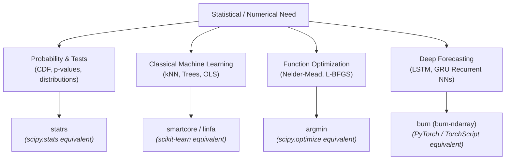
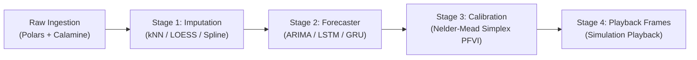

# Rust Crates for Statistical Computation, Machine Learning & Forecasting

This document provides a reference guide to the Rust ecosystem crates dedicated to statistical computation, machine learning, optimization, and time series forecasting, with equivalents in Python (`scipy`, `statsmodels`, `scikit-learn`) and R (`stats`, `forecast`).

---

## 1. Overview Matrix

| Domain | Rust Crate | Python / R Equivalent | Primary Use Case |
|---|---|---|---|
| **Distributions & Tests** | [`statrs`](https://crates.io/crates/statrs) | `scipy.stats` / R `stats` | Probability distributions (PDF, CDF, quantiles), hypothesis tests, and special functions ($\Gamma$, $\beta$, $\text{erf}$) |
| **Descriptive Stats** | [`statistical`](https://crates.io/crates/statistical) | Python `statistics` | Basic statistical summaries (mean, median, mode, variance, covariance) |
| **Streaming Stats** | [`average`](https://crates.io/crates/average) | — | Online, single-pass statistics with $O(1)$ memory consumption |
| **Classical Machine Learning** | [`smartcore`](https://crates.io/crates/smartcore) | `scikit-learn` | $k$-Nearest Neighbors ($k\text{NN}$), linear/ridge regression, decision trees, PCA |
| **Modular Machine Learning** | [`linfa`](https://crates.io/crates/linfa) | `scikit-learn` | Modular ML algorithms natively built atop the `ndarray` array ecosystem |
| **Continuous Optimization** | [`argmin`](https://crates.io/crates/argmin) | `scipy.optimize` / R `optim()` | Nelder-Mead simplex, L-BFGS, conjugate gradient, simulated annealing |
| **Nonlinear Constraints** | [`cobyla`](https://crates.io/crates/cobyla) | `scipy.optimize.fmin_cobyla` | Derivative-free optimization under nonlinear inequality constraints |
| **Time Series Modeling** | [`anofox-forecast`](https://crates.io/crates/anofox-forecast) | R `forecast` / `pmdarima` | Automated time series forecasting and model order selection |
| **ARIMA Models** | [`arima`](https://crates.io/crates/arima) | `statsmodels.tsa.arima` | Classical ARIMA process simulation, estimation, and prediction |
| **Deep Learning Engine** | [`burn`](https://crates.io/crates/burn) | PyTorch / TensorFlow | Recurrent neural networks (LSTM, GRU), automatic differentiation, dynamic computation graphs |
| **$N$-Dimensional Arrays** | [`ndarray`](https://crates.io/crates/ndarray) | `numpy` | Multidimensional array views, strided slicing, matrix linear algebra |
| **Linear Algebra & Geometry** | [`nalgebra`](https://crates.io/crates/nalgebra) | `scipy.linalg` | Matrix factorizations (LU, QR, Cholesky, SVD) and vector transformations |

---

## 2. Detailed Crate Profiles

### 2.1 `statrs` — Classical Probability & Mathematical Statistics
- **Ecosystem Role**: The most comprehensive statistics crate in Rust, serving as the direct equivalent to `scipy.stats`.
- **Key Features**:
  - Continuous distributions: Normal, Uniform, Beta, Chi-squared, Student's $t$, Cauchy, Dirichlet, Exponential, Fisher-Snedecor $F$, Gamma, Log-Normal, Pareto, Weibull.
  - Discrete distributions: Binomial, Poisson, Bernoulli, Geometric, Hypergeometric, Negative Binomial.
  - Implements `Distribution`, `ContinuousCDF`, and `DiscreteCDF` traits with exact `.cdf()`, `.inverse_cdf()`, and `.pdf()` / `.pmf()` functions.
  - Special functions: Lanczos Gamma function, Incomplete Gamma, Digamma, Beta function, Error Function ($\text{erf}$, $\text{erfc}$).
- **Example**:
  ```rust
  use statrs::distribution::{ChiSquared, ContinuousCDF};

  let chi2 = ChiSquared::new(4.0).unwrap(); // 4 degrees of freedom
  let p_value = 1.0 - chi2.cdf(9.488);     // Survival probability (p-value)
  ```

---

### 2.2 `smartcore` — Production-Ready Machine Learning
- **Ecosystem Role**: Standalone, batteries-included machine learning library designed for high-performance CPU inference and training.
- **Key Features**:
  - **Clustering & Neighbors**: $k\text{NN}$ regression and classification (Euclidean, Manhattan, Minkowski distances), $k$-Means, DBSCAN.
  - **Supervised Regression**: Ordinary Least Squares (OLS), Ridge, Lasso, ElasticNet.
  - **Ensemble Learning**: Random Forest regression and classification, Extra Trees.
  - **Metrics**: Mean Squared Error (MSE), Root Mean Squared Error (RMSE), Mean Absolute Error (MAE), $R^2$.
- **Example**:
  ```rust
  use smartcore::neighbors::knn_regressor::*;
  use smartcore::linalg::basic::matrix::DenseMatrix;

  let x = DenseMatrix::from_2d_array(&[&[1.0, 2.0], &[2.0, 3.0], &[3.0, 4.0]]);
  let y = vec![2.0, 3.0, 4.0];
  let knn = KNNRegressor::fit(&x, &y, KNNRegressorParameters::default().with_k(2)).unwrap();
  ```

---

### 2.3 `argmin` — Extensible Numerical Optimization
- **Ecosystem Role**: Rust's primary optimization framework, equivalent to `scipy.optimize.minimize` and R's `optim()`.
- **Key Features**:
  - **Nelder-Mead Simplex**: Derivative-free multi-dimensional parameter search (essential for calibrating models like the PFVI fire vulnerability index).
  - **L-BFGS & BFGS**: Quasi-Newton gradient optimization for smooth loss landscapes.
  - **Conjugate Gradient & Gradient Descent**: Solvers for quadratic and non-linear systems.
  - **Observer System**: Stream optimization progress, iteration losses, and parameter vectors across channels.
- **Example**:
  ```rust
  use argmin::core::{CostFunction, Executor};
  use argmin::solver::neldermead::NelderMead;

  struct RosenebrockCost;
  impl CostFunction for RosenebrockCost {
      type Param = Vec<f64>;
      type Output = f64;
      fn cost(&self, p: &Self::Param) -> Result<Self::Output, argmin::core::Error> {
          Ok((1.0 - p[0]).powi(2) + 100.0 * (p[1] - p[0].powi(2)).powi(2))
      }
  }
  ```

---

### 2.4 `burn` — Deep Learning Engine for Time Series
- **Ecosystem Role**: Flexible, pure-Rust deep learning engine with dynamic computation graphs, automatic differentiation, and multi-backend support.
- **Key Features**:
  - **Backends**: `burn-ndarray` (CPU execution via `ndarray`), `burn-wgpu` (cross-platform GPU), `burn-cuda`, and `burn-candle`.
  - **Recurrent Architectures**: Native `burn::nn::Lstm` and `burn::nn::Gru` modules.
  - **Optimizers**: Integrated Adam, AdamW, and SGD implementations.
  - **Deterministic Training**: Explicit RNG seeding for exact reproducibility across runs.
- **Application in `pfrsim`**:
  - Powers `crates/pfrsim-core/src/forecaster/lstm.rs` and `gru.rs` for multi-step time series forecasting without Python or CUDA runtime dependencies.


---

### 2.5 `anofox-forecast` — Automated Time Series Forecasting & Decomposition
- **Ecosystem Role**: Dedicated Rust time series forecasting library (by Simon Müller), serving as the direct Rust equivalent of R's `forecast` / `fable` and Python's `statsforecast` / `pmdarima`.
- **Key Features**:
  - **35+ Model Families**:
    - **ARIMA / SARIMA**: `AutoARIMA` with stepwise $(p, d, q)(P, D, Q)[s]$ selection, unit-root differencing, and state-space Kalman filtering.
    - **Exponential Smoothing**: `ETS`, `AutoETS`, Holt-Winters, Simple Exponential Smoothing.
    - **Complex Seasonality**: `MSTLForecaster` (Multiple Seasonal-Trend decomposition using LOESS) and `TBATS` / `AutoTBATS` (trigonometric Box-Cox ARMA trend seasonal models).
    - **Theta Methods**: Standard `Theta`, `DynamicTheta`, and `AutoTheta` (M3/M4 competition benchmarks).
    - **Multivariate**: `VAR` (Vector Autoregression) for interdependent multi-series modeling.
    - **Financial Volatility**: `GARCH` for conditional heteroskedasticity.
    - **Intermittent Demand**: Croston, TSB, ADIDA, and IMAPA for sparse, zero-inflated demand.
    - **Auto-Ensembles**: `AutoForecast` and `AutoEnsemble` for cross-validated model selection and weighted stacking.
  - **Core Dependencies**:
    - Linear algebra: Built on [`faer`](https://crates.io/crates/faer) (pure-Rust BLAS-equivalent matrix engine).
    - Concurrency: Optional multi-threading via [`rayon`](https://crates.io/crates/rayon).
    - Extensibility: Dual interfaces as a native Rust crate and as a DuckDB SQL analytical extension.
- **Architectural Tradeoff in `pfrsim`**:
  - In `specs/00`, `01`, and `05`, `anofox-forecast` was evaluated in Phase 2a as a potential candidate for upstream AutoARIMA.
  - *Design Decision*: `pfrsim-core` chose the documented fallback path (self-contained profile Box-Cox $\lambda \in [-2, 2]$ search, Conditional Sum of Squares AIC order search, and Ljung-Box test).
  - *Benefits for `pfrsim`*:
    1. **Zero Native BLAS/C Linkage**: Avoids external linear algebra packaging complexity on desktop targets.
    2. **Exact Bug-for-Bug Parity**: Matches the sibling R package `peatfr`'s specific parameter transforms and boundary behaviors without upstream divergence.
    3. **Deterministic Seed Stability**: Guarantees identical output hashes (`frames_sha256`) for immutable playback replay.
---

## 3. Recommended Stack Selection Guide



---

## 4. Application to `pfrsim`

The `pfrsim` desktop simulator relies on these principles for its pure-Rust pipeline:

1. **Interpolation & Imputation (`crates/pfrsim-core/src/imputer/`)**:
   - kNN distance weighting and Cleveland's LOESS local regression implemented in pure Rust.
2. **Parametric Time Series (`crates/pfrsim-core/src/forecaster/arima.rs`)**:
   - Analytical Box-Cox profile likelihood search, $(p, d, q)$ order search via Akaike Information Criterion (AIC), and Ljung-Box residual diagnostics with $\chi^2$ survival functions.
3. **Deep Recurrent Forecasting (`crates/pfrsim-core/src/forecaster/{lstm, gru}.rs`)**:
   - `burn::nn::Lstm` and `burn::nn::Gru` running on `burn::backend::Autodiff<burn::backend::NdArray<f32>>` with Adam optimization.
4. **Fire Vulnerability Optimization (`crates/pfrsim-core/src/pfvi.rs`)**:
   - Multi-dimensional Nelder-Mead simplex calibration bounded by grid polish to optimize the 4-parameter soil fluctuation function $(aH, bH, n, \alpha)$.

