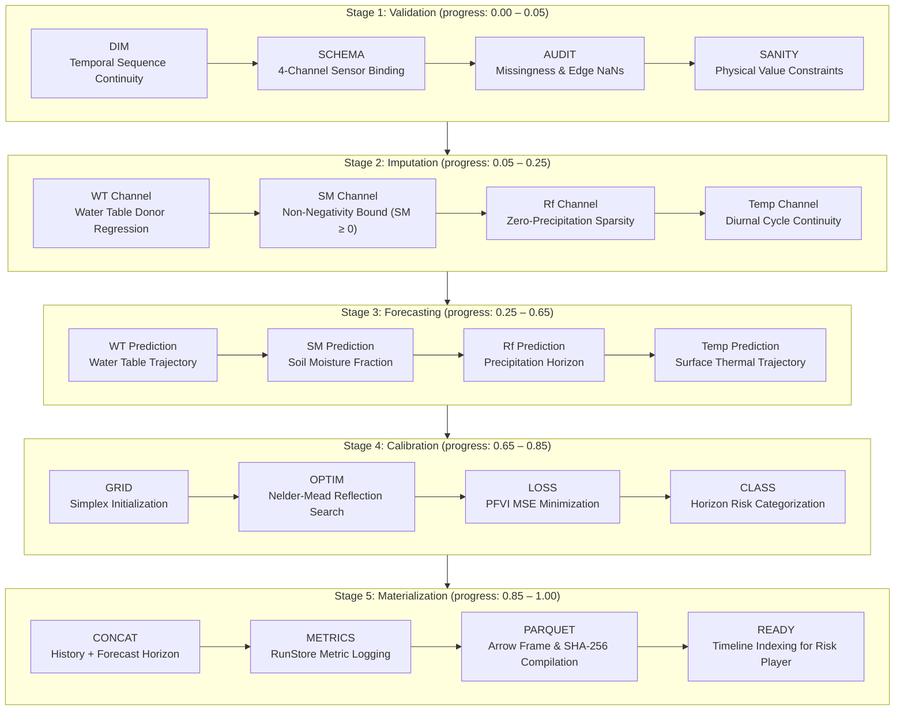
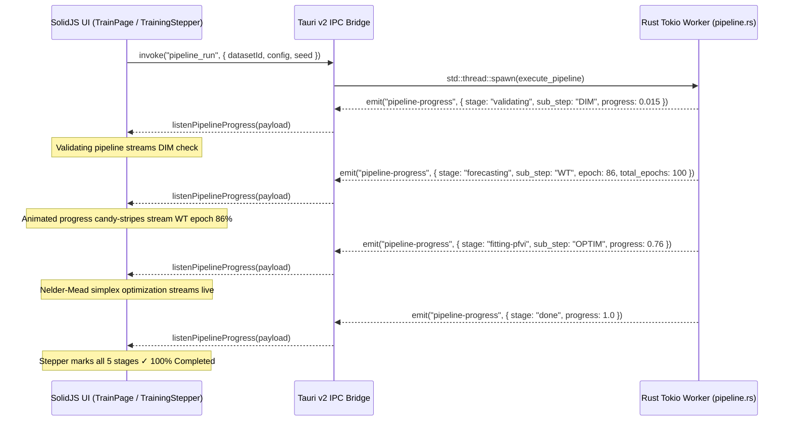

# pfrsim — Training Pipeline & Mathematical Process Reference

This document provides a comprehensive technical reference for the training pipeline of **`pfrsim`** (Peatland Fire Risk Simulator). It covers the in-process Rust numerical engine (`pfrsim-core`), data sanity validation, missingness imputation algorithms, timeseries forecasting (AutoARIMA and Deep Recurrent Networks LSTM/GRU), Nelder-Mead calibration of the Peatland Fire Vulnerability Index (PFVI), artifact materialization, and real-time IPC telemetry streaming.

---

## 1. Pipeline Overview & Execution Architecture

The training pipeline executes as an asynchronous background worker managed by a Tokio runtime thread in Rust. It takes raw environmental timeseries observations, cleans and validates inputs, imputes missing spans, projects forward multi-step trajectories, calibrates physical vulnerability parameters, and serializes cryptographic artifacts for interactive timeline playback.

---

## 2. Stage-by-Stage Technical Specifications

### Stage 1: Validation (Data Sanity & Telemetry Verification)
- **Progress Range**: `0.00` – `0.05`
- **Sub-Steps**:
  1. `DIM`: Verifies that observation count $N \ge 8$. Checks that timestamps are strictly monotonic with consistent sampling intervals $\Delta t$.
  2. `SCHEMA`: Binds the four load-bearing hydrological and meteorological channels:
     - **WT**: Water Table Depth ($m$)
     - **SM**: Volumetric Soil Moisture ($\text{m}^3/\text{m}^3$)
     - **Rf**: Precipitation / Rainfall ($\text{mm}$)
     - **Temp**: Surface Temperature ($^\circ\text{C}$)
  3. `AUDIT`: Audits leading/trailing edge NaNs, internal gap spans, and overall sparsity. Fails fast if the imputer is set to Linear and edge NaNs cannot be extrapolated.
  4. `SANITY`: Checks physical domain constraints (e.g. non-negative rainfall $Rf_t \ge 0$, realistic temperature bounds).

---

### Stage 2: Imputation (Missing Data Resolution)
- **Progress Range**: `0.05` – `0.25`
- **Supported Algorithms**:
  - **k-Nearest Neighbors (k-NN)**: Joint 4-variable Euclidean donor search with distance-weighted average (`VIM::kNN` parity).
  - **Local Regression Smoothing (LOESS)**: Cleveland's tricube kernel weighted regression with configurable smoothing span $\alpha \in [0.05, 1.0]$.
  - **Cubic Spline**: Natural cubic spline interpolation ensuring continuous first and second derivatives.
  - **Linear Interpolation**: Fast piecewise linear interpolation (`zoo::na.approx` parity).
- **Physical Invariants**:
  - Soil moisture non-negativity: $SM_t = \max(0, \widehat{SM}_t)$.
  - Rainfall sparsity: zero-precipitation days are preserved to prevent synthetic micro-drizzle.

---

### Stage 3: Forecasting (Multi-Variable Horizon Trajectory)
- **Progress Range**: `0.25` – `0.65`
- **Architecture**: **Decoupled Independent Univariate Forecasting**
  - The 4 load-bearing channels ($WT, SM, Rf, Temp$) are modeled as independent univariate timeseries.
  - **Physical Rationalization**: Rainfall ($Rf$) and air temperature ($Temp$) are exogenous meteorological drivers, while water table ($WT$) and soil moisture ($SM$) are subsurface hydrological responses. Decoupling projections prevents unphysical feedback loops (such as groundwater canal drawdown falsely predicting atmospheric rain generation) and enables robust training on short peatland observation records ($N \ge 8$). Multivariate cross-coupling is executed downstream in Stage 4 via physical differential equations.

#### AutoARIMA + Box-Cox (Statistical Parity)
- **Box-Cox Power Transformation**: Estimates optimal parameter $\lambda \in [-1.0, 2.0]$ by maximizing profile log-likelihood:
  $$\ell(\lambda) = -\frac{N}{2} \ln(\hat{\sigma}^2) + (\lambda - 1)\sum_{t=1}^N \ln(y_t)$$
  - **Additive Modeling for Temperature**: Atmospheric surface temperature ($Temp$) is strictly assigned $\lambda = 1.0$ (linear identity, $y = w + 1.0$), ensuring pure additive modeling for Gaussian diurnal cycles and preventing non-linear scale compression.
  - **Identity Snapping**: If $|\lambda - 1.0| < 0.06$, $\lambda$ snaps to $1.0$ to eliminate unnecessary non-linear distortions.
- **Numerical Stability & Inverse Transformation (`box_cox_invert`)**:
  - **Asymptote Protection**: When $\lambda \ne 0$, the base term is guarded against non-positive divergence: $\text{base} = (\lambda w + 1).\max(10^{-3})$.
  - **Guarded Taylor-Series Bias Adjustment**: Mean bias correction uses the second-order Taylor expansion only when stable:
    $$\text{adj} = \frac{\sigma^2 (1 - \lambda)}{2 \cdot \text{base}^2}$$
    If $|\text{adj}| > 0.5$ or non-finite, the diverging higher-order term is dropped ($\text{adj} = 0.0$), preventing the astronomical division spikes ($10^{16}$) seen in unconstrained implementations.
- **Order Search $(p, d, q)$**: Automated grid search ($p, q \in [0, 2], d \in [0, 1]$) minimizing AIC and BIC with in-place residual memory reuse.
- **White-Noise Residual Diagnostics**: Ljung-Box test statistic evaluated against $\chi^2$ CDF via `statrs`:
  $$Q = N(N + 2)\sum_{k=1}^m \frac{\hat{r}_k^2}{N - k}$$
- **Physical Domain Clamping**: Output trajectories are constrained to physical feasibility ($Rf \ge 0$, $SM \in [0, 100\%]$, $WT \in [-5.0\text{ m}, +2.0\text{ m}]$, $Temp \in [5^\circ\text{C}, 65^\circ\text{C}]$).

#### Deep Recurrent Networks: LSTM & GRU
- **Framework**: Native compiled Rust tensor execution via the **Burn** deep learning framework.
- **Dual-Backend Acceleration**:
  - **CPU Backend**: Multi-threaded execution powered by `burn-ndarray` (`NdArray<f32>`).
  - **GPU Compute Shaders**: Hardware-accelerated autodiff via `burn-wgpu` (`Autodiff<Wgpu>`), dispatching parallel WGSL compute shaders directly to Vulkan, DirectX 12, or Metal adapters without requiring proprietary CUDA runtimes.
- **Configurable Hyperparameters**:
  - **Mini-Batch Sizing ($B$)**: Flexible mini-batch SGD ($B \in [16, 2048]$) or full-batch gradient descent ($B = 0$). On small records, full-batch converges smoothly, whereas on high-sample regimes (>100k rows), mini-batching enables GPU compute shader saturation.
  - **Adam Learning Rate ($\eta$)**: Configurable learning rate $\eta \in [0.001, 0.1]$ (default $0.02$) with adaptive first/second moment estimation ($\beta_1 = 0.9, \beta_2 = 0.999, \epsilon = 10^{-8}$) and gradient clipping.
  - **Sequence Lookback ($L$)**: Sliding temporal window $L \in [1, 60]$ timesteps across Min-Max normalized sensor channels ($[0, 1]$).
  - **Hidden Dimensionality ($d$)**: Configurable hidden state size ($d \in [4, 64]$ units).
- **Deterministic Replay Guarantee**:
  - Training seeds are explicitly fed into the Burn PRNG (`WgpuDevice` / `NdArrayDevice`), ensuring byte-identical weights and forecasts across repeated runs with identical configurations.
- **Resilient Thread Supervision**:
  - Background worker threads execute inside `std::panic::catch_unwind`. Any numerical anomalies or unexpected divergences fail gracefully, logging error state to `runs.sqlite` and streaming structured notifications to the frontend without crashing the desktop window.
---

### Stage 4: Calibration (Nelder-Mead PFVI Simplex Fitting)
- **Progress Range**: `0.65` – `0.85`
- **Objective Function**:
  Nelder-Mead downhill simplex optimization minimizes Mean Squared Error ($\text{MSE}$) between observed empirical fire vulnerability and physical peatland water balance:
  $$\min_{a_H, b_H, n, \alpha} \text{MSE} = \frac{1}{N} \sum_{t=1}^N \left( \text{PFVI}_t(a_H, b_H, n, \alpha) - \text{DI}_{\text{obs}, t} \right)^2$$
- **Zero-Allocation Objective Evaluation**:
  - Invariant series ($h_{\text{depth}} = \max(0, -WT)$, $DI_{\text{obs}}$, $RF$) are precomputed once before simplex search.
  - The inner loop executes a scalar running state update ($x_0$), eliminating ~48,000 vector heap allocations per calibration run.
- **Simplex Operations**:
  1. `GRID`: Simplex initialization around prior vertices $x_0 = [a_H, b_H, n, \alpha]$.
  2. `OPTIM`: Iterative reflection ($x_r$), expansion ($x_e$), contraction ($x_c$), and shrinkage ($x_s$).
  3. `POLISH`: Bounded multi-dimensional grid search polish ($m \in [1, 3]$, $m^4 \le 81$) with an elapsed timeout guard (preventing the R package $m = 1/\text{par}_3$ infinite freeze).
  4. `LOSS`: Convergence check against tolerance $\epsilon \le 10^{-6}$ or evaluation budget limit.
  5. `CLASS`: Hazard severity threshold assignment on the 0–300 PFVI scale:
     - **Low (0)**: $\text{PFVI} \le 75$
     - **Moderate (1)**: $75 < \text{PFVI} \le 150$
     - **High (2)**: $150 < \text{PFVI} \le 225$
     - **Extreme (3)**: $\text{PFVI} > 225$

---

### Stage 5: Materialization & Export (Artifact Assembly & Deployment)
- **Progress Range**: `0.85` – `1.00`
- **Artifacts Materialized on Disk (`models/<run_id>/`)**:
  1. `CONCAT`: Concatenates observed timeseries ($1 \dots n$) with forecast horizon ($n+1 \dots n+h$) into unified simulation frames.
  2. `METRICS`: Logs evaluation metrics (RMSE, MAE, MSE, Box-Cox $\lambda$, Nelder-Mead parameter vectors) into SQLite WAL storage (`runs.sqlite`).
  3. `PARQUET`: Encodes structured frames into binary Apache Parquet tables (`frames.parquet`) with SHA-256 manifest verification.
  4. `READY`: Indexes frame time steps for scrubbing and playback in the interactive Risk Player.
- **Operational Export Hub**:
  - **ONNX Runtime Bundle (`onnx_<run_id>/`)**: Standalone binary `model.onnx` graph (IR v8, opset 17) with `onnx_runtime_inference.py`, metadata schema, and provenance copies for production inference across Python, Node.js, C++, and Rust (`ort`).
  - **MLflow Tracking Bundle (`mlflow_<run_id>/`)**: Standard MLflow FileStore (`mlruns/`) with `mlflow_replay.py` for logging parameters, metrics, and tags to remote/local tracking servers.
  - **Raw Exports**: Structured CSV files (`imputed.csv`, `forecast.csv`, `pfvi.csv`) for external spreadsheet and GIS integration.
---

## 3. Real-Time Telemetry & Progress Streaming Protocol

The frontend and backend coordinate through an asynchronous, event-driven IPC bridge:

### Granular Sub-Step IPC Reference

| Stage | `sub_step` Code | Description | Sub-Step Progress |
|---|---|---|---|
| **Validating** | `DIM` | Temporal sequence continuity and row count verification | 1.5% |
| | `SCHEMA` | 4-channel telemetry schema binding (WT, SM, Rf, Temp) | 3.0% |
| | `AUDIT` | Gap distribution and edge NaN sparsity audit | 4.0% |
| | `SANITY` | Boundary limit and domain range validation | 5.0% |
| **Imputing** | `WT` | Water Table donor regression / gap estimation | 10.0% |
| | `SM` | Soil Moisture non-negativity constraint ($SM \ge 0$) | 15.0% |
| | `Rf` | Zero-precipitation sparsity preservation | 20.0% |
| | `Temp` | Diurnal thermal cycle continuity interpolation | 25.0% |
| **Forecasting** | `WT` | Water Table neural recurrence & horizon trajectory | Live Epochs |
| | `SM` | Volumetric soil moisture fraction prediction | Live Epochs |
| | `Rf` | Precipitation horizon estimation | Live Epochs |
| | `Temp` | Surface temperature diurnal profile | Live Epochs |
| **Calibration** | `GRID` | Initial Nelder-Mead simplex grid vertex setup | 70.0% |
| | `OPTIM` | Simplex reflection, expansion & contraction iterations | 76.0% |
| | `LOSS` | Peat fire vulnerability index MSE error minimization | 81.0% |
| | `CLASS` | Horizon risk band assignment (Low, Mod, High, Extreme) | 85.0% |
| **Materializing** | `CONCAT` | Timeseries concatenation ($1..n$ historical + $n+1..n+h$ horizon) | 88.0% |
| | `METRICS` | Writing evaluation metrics to RunStore SQLite WAL | 92.0% |
| | `PARQUET` | Serializing Arrow/Parquet tables and SHA-256 manifest | 96.0% |
| | `READY` | Indexing time steps for timeline playback in Risk Player | 100.0% |

---

## 4. UI Streaming Component (`TrainingStepper.tsx`)

The frontend visualizes the pipeline using fine-grained SolidJS reactivity:
- **Animated Striped Progress Bar**: Powered by `@keyframes progress-stripes` with high-contrast diagonal candy-stripe gradients.
- **Zero Re-Render Architecture**: The stage sub-steps are rendered via `<Index each={...}>` over static definitions. Progress width and percentage labels update directly on DOM attributes without tearing down components or restarting animations.
- **Interactive Stage Inspection**: Clicking any step in the 5-step horizontal stepper allows users to review the sub-step execution breakdown for any stage, while automatically tracking the live stage during active training.
- **Clean Stage Headers**: Raw backend debug strings (e.g. `(Temp epoch 100/100)`) are sanitized into clean, localized stage names (`Stage: Forecasting` / `Tahap: Prakiraan`).
- **Contrast & Visibility**: Uses prominent `h-3` progress bar tracks with `shadow-inner` and defined borders, ensuring visibility across both dark and light modes.

---

## 5. Related Academic Documentation & Modeling Insights

- **[Peatfr Academic Paper Summary & Univariate/Multivariate Analysis](./peatfr-paper-summary.md)**: Exhaustive synthesis of the original peer-reviewed paper (*Ecological Informatics*, 2025), Sabangau empirical error benchmarks, and mathematical rationale for using independent univariate timeseries projections coupled with physical Stage 4 PFVI differential equations.
